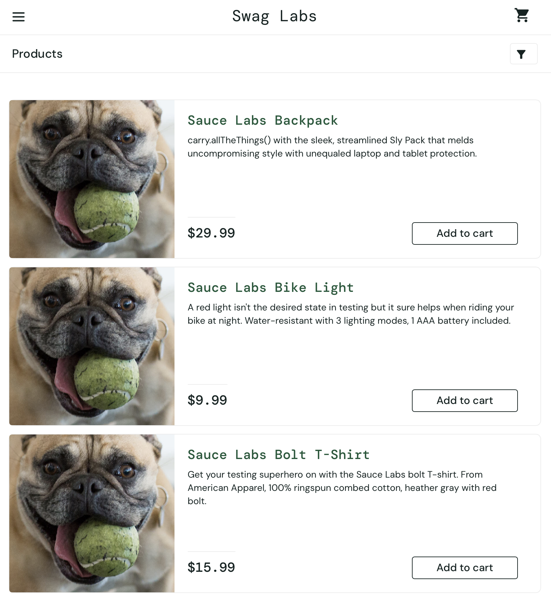

**Баг-репорт:** Дублирование изображений товаров для problem_user

**ID:** BUG-01

**Приоритет:** High

**Серьезность:** Major 

**Заголовок:** Отображение одинакового изображения для всех карточек товаров под пользователем problem_user.

**Окружение:** macOS 13.5, Safari 17.0, Screen: 13.6" (MacBook Air M2).

**Шаги воспроизведения:**

Открыть https://www.saucedemo.com.

Авторизоваться с данными:

Username: problem_user

Password: secret_sauce

Перейти на страницу каталога (/inventory.html).

Визуально оценить изображения в карточках товаров.

**Ожидаемый результат:**
Каждому товару соответствует уникальное изображение, релевантное названию и описанию.

**Фактический результат:**
У всех товаров отображается заглушка или одно и то же некорректное изображение (собака с мячом во рту).

**Технические детали (для отладки):**

Под пользователем standard_user проблема не воспроизводится.

**Вложения:**

   **Рис.1** Скриншот ошибки

