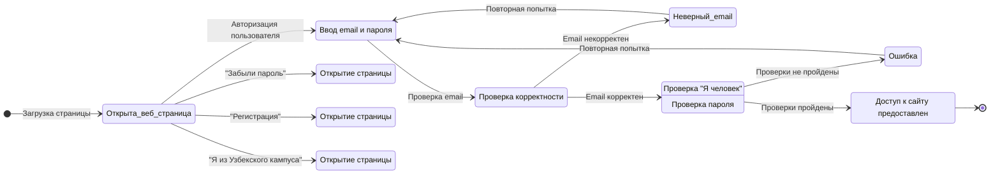

# Тест-дизайн: Диаграмма переходов и состояний
Страница авторизации `https://applicant.21-school.ru/auth`

## Диаграмма

```mermaid
stateDiagram-v2
    direction LR

    [*] --> Открыта_веб_страница: Загрузка страницы

    Открыта_веб_страница --> Ввод: Авторизация пользователя
    Ввод : Ввод email и пароля

    Ввод --> Проверка_email: Проверка email
    Проверка_email : Проверка корректности

    Проверка_email --> Неверный_email: Email некорректен
    Неверный_email --> Ввод: Повторная попытка

    Проверка_email --> Проверка_человека: Email корректен
    Проверка_человека : Проверка "Я человек"
    Проверка_человека : Проверка пароля

    Проверка_человека --> Ошибка: Проверки не пройдены
    Ошибка --> Ввод: Повторная попытка

    Проверка_человека --> Результат: Проверки пройдены
    Результат : Доступ к сайту предоставлен

    Результат --> [*]

    Открыта_веб_страница --> Восстановление: "Забыли пароль"
    Восстановление : Открытие страницы

    Открыта_веб_страница --> Регистрация: "Регистрация"
    Регистрация : Открытие страницы

    Открыта_веб_страница --> Узбекский_кампус: "Я из Узбекского кампуса"
    Узбекский_кампус : Открытие страницы

```